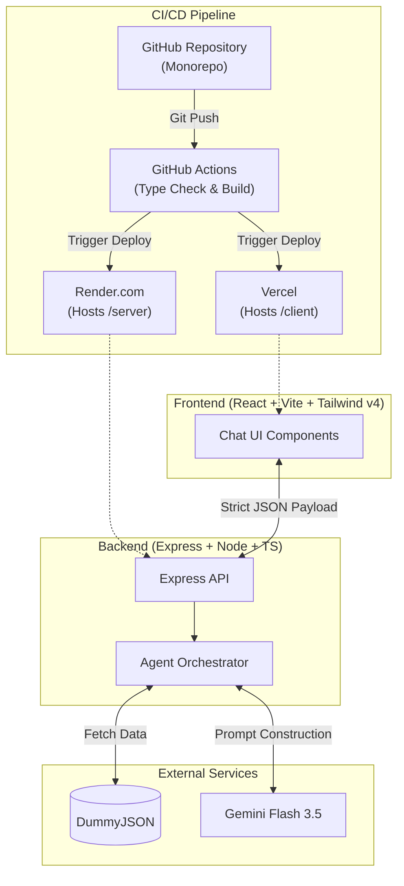
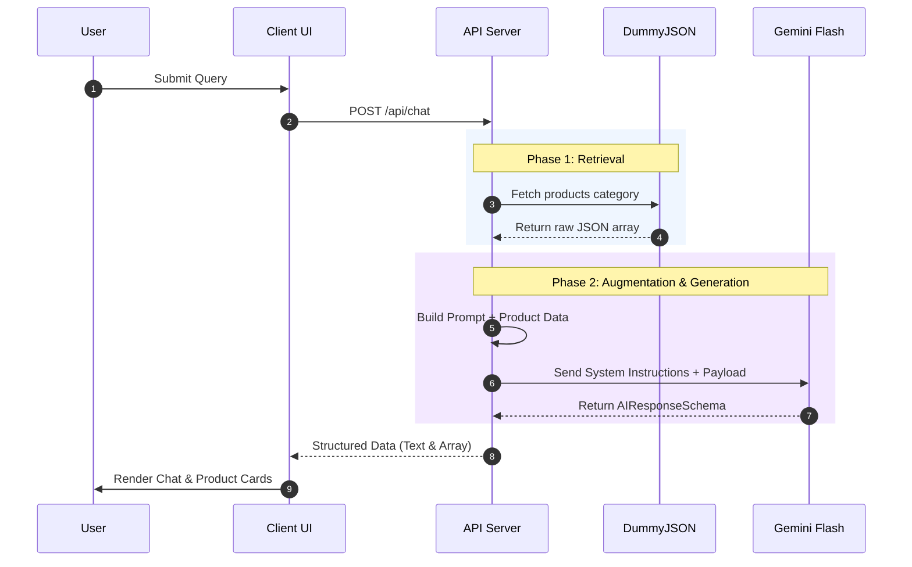

# AI RAG Agent Architecture

> **🤖 Agent Routing:** Architect agents should read this for full-stack RAG context. Frontend/Backend agents can use this to understand the Client/Server split.

> **🧠 LLM Context:** This document details the system design of the AI RAG Agent, which uses a React frontend, Express backend, DummyJSON for data, and Gemini Flash 3.5 for Semantic Search and Q&A.

## 📌 Overview
The system is built as a monorepo separated into `client` (React + Vite) and `server` (Express). The app allows users to perform semantic product searches and Q&A using a Retrieval-Augmented Generation (RAG) approach to prevent AI hallucination.

## 🏗️ Core Architecture & CI/CD

## 🔄 RAG Data Flow Sequence

## 🛠️ Core Features
- **Semantic Product Search:** AI analyzes intent, bypassing basic keyword matching.
- **RAG-Powered Q&A:** Grounded exclusively in DummyJSON data.
- **Structured JSON Rendering:** Gemini returns structured JSON (`AIResponse`), which the frontend renders as Product Cards.
- **Context-Aware Memory:** Session history is maintained to allow continuous, contextual prompting.

## 🔗 Related Context
- `shared/types.ts` contains shared types `Product`, `ChatRequest`, and `AIResponse`.
