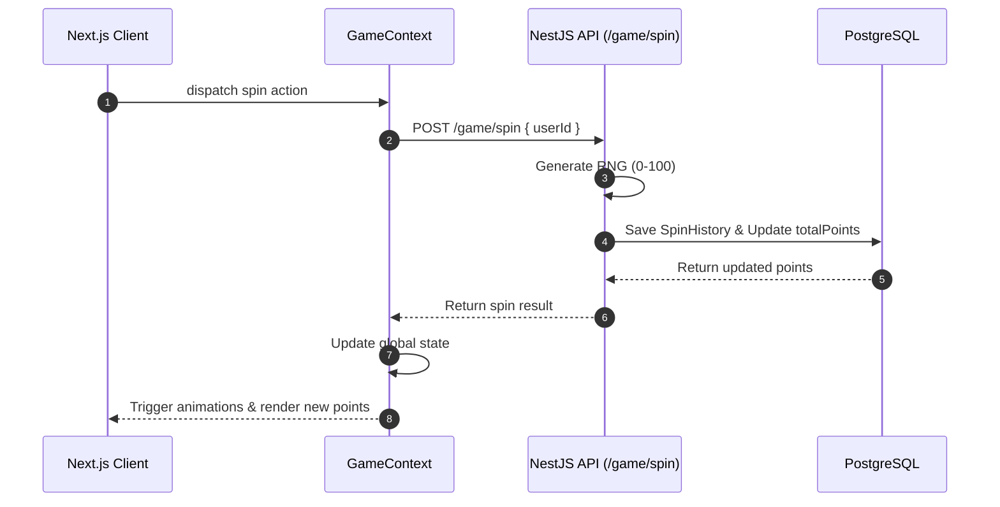

# Nextzy Gamification Full-Stack Architecture

> **🤖 Agent Routing:** All agents should start here to understand the high-level separation of concerns between the client and server applications.

> **🧠 LLM Context:** This defines the macro-architecture of the Nextzy Gamification platform. It is a decoupled full-stack application using Next.js for the UI and NestJS for the API.

## 📌 Overview
The system is built as a classic SPA/API decoupled stack. The client and server live in separate directories (`nextzy-game-client` and `nextzy-game-server`) and communicate exclusively over REST over HTTP.

## 🏗️ Core Details

### 1. The Frontend (Nextzy Game Client)
- **Framework:** Next.js (App Router)
- **Language:** TypeScript
- **Styling:** Tailwind CSS (v4)
- **State Management:** React Context API (`GameContext.tsx`) for global user state, eliminating the need for Redux or Zustand.
- **Role:** Handles the UI rendering, gacha animations, and tracking local state before syncing with the backend.

### 2. The Backend (Nextzy Game Server)
- **Framework:** NestJS
- **Language:** TypeScript
- **Database:** PostgreSQL
- **ORM:** Prisma
- **Role:** Acts as the authoritative source of truth. Handles the actual RNG (Random Number Generation) for the gacha spin to prevent client-side cheating, calculates points, and prevents race conditions using database constraints.

## 🔄 Data Flow (The Gacha Spin)

## 🔗 Related Context
- [[nextzygame-db-schema]]
- [[nextzygame-api]]
- [[nextzygame-frontend-architecture]]
