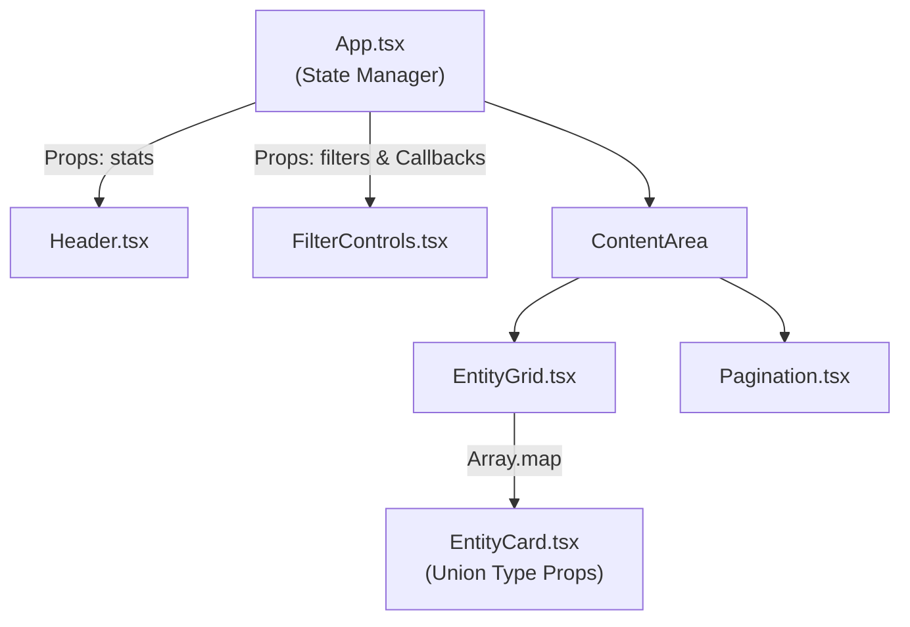
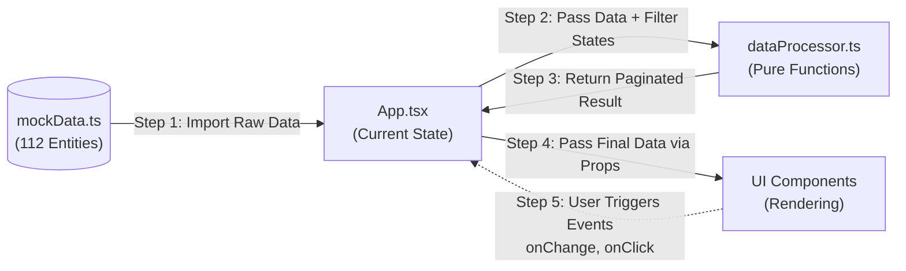

# TypeSith Architecture

> **🤖 Agent Routing:** Architect agents should read this to understand the high-level system design. DevOps agents can reference the related_tools to understand the build requirements (Vite). Frontend agents need this as a starting point.

> **🧠 LLM Context:** This file outlines the system design and tech stack of TypeSith, a React SPA built with TypeScript, Vite, and TailwindCSS.

## 📌 Overview
TypeSith is a frontend-only React SPA functioning as a "Galactic Records" training ground. It uses mock data and pure client-side state management to filter, sort, and display character entities.

## 🏗️ Core Details
- **Build Tool:** Vite
- **Language:** TypeScript (`strict` mode enabled)
- **Styling:** TailwindCSS (v4)
- **Linting:** ESLint with React Hooks and React Refresh plugins.
- **Data Flow:** Top-down data flow from `App.tsx`, which delegates heavy state management to a central custom hook (`useForceCodex`).
- **Logic Separation:** The architecture explicitly separates pure business logic (filtering, sorting, pagination in `src/utils/dataProcessor.ts`) from React component state (in `src/hooks/useForceCodex.ts`). This ensures high testability and prevents UI components from bloating with data manipulation logic.

### Component Hierarchy

### Data Flow Diagram

## 🔗 Related Context
- [[typesith-components]]
- [[typesith-workflows]]
- [[typesith-state-management]]
